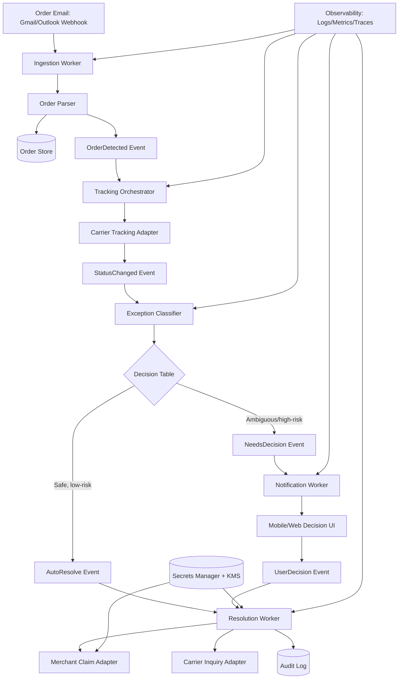

# ClaimPilot Architecture Diagram

This diagram represents the full target architecture across all implementation phases, with a clear MVP path and future-ready extensions.

## System Diagram

## Runtime Boundaries

- Ingestion boundary: read-only mailbox permissions; no retailer password collection.
- Decision boundary: classifier only auto-resolves policy-safe actions.
- Security boundary: merchant session tokens are scoped, short-lived, and encrypted.
- Human-in-the-loop boundary: damaged-item proof and high-risk claims require explicit user decisions.

## Phase Mapping

- Phase 1: In-memory pipeline, classifier, audit base.
- Phase 2: Email ingestion and carrier tracking adapters.
- Phase 3: Resolution and decision workers with guardrails.
- Phase 4: Demo UI and scenario triggers.
- Phase 5: Reliability, security, and test hardening.
- Phase 6-7: Submission packaging and final compliance run.
