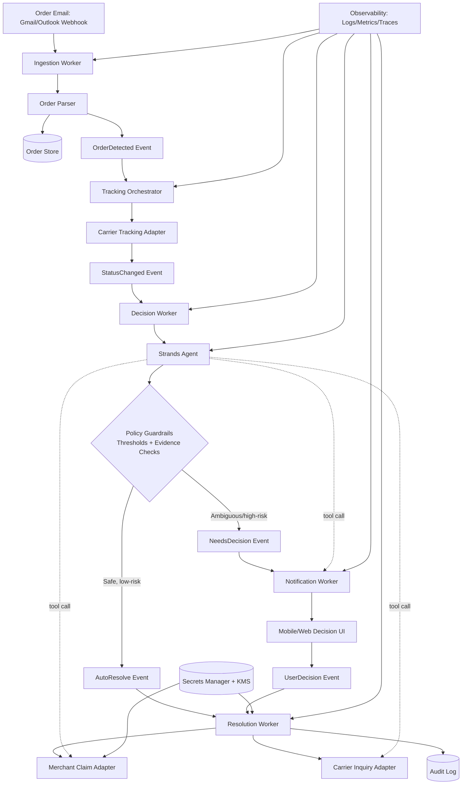
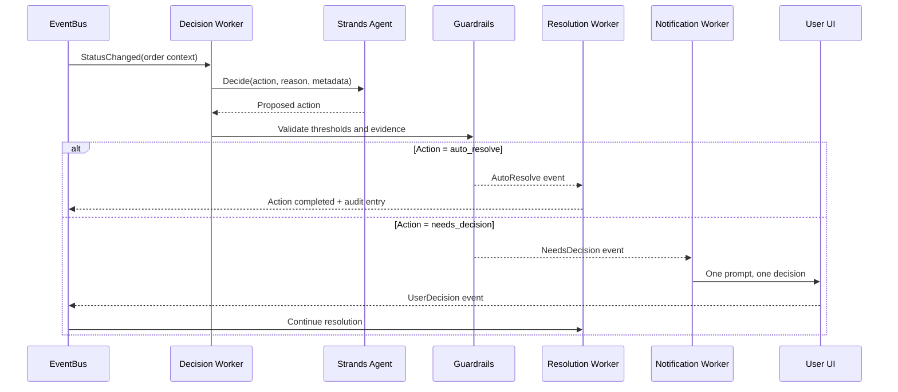

# ClaimPilot Architecture Diagram

This diagram represents the full target architecture across all implementation phases, with a clear MVP path and future-ready extensions.

## System Diagram (Strands Explicit)

## How Strands Works in This Flow

## Strands Responsibilities

- Convert status-change context into a structured decision: auto_resolve or needs_decision.
- Provide explainable rationale and metadata for audit logs.
- Select the next operational tool path (claim action, carrier inquiry, or notification).
- Defer high-risk or ambiguous cases to human confirmation.

## What Strands Does Not Replace

- Event transport and orchestration (EventBridge/SQS/Lambda pattern).
- Data storage (order and audit stores).
- Secret management (Secrets Manager + KMS).
- Policy enforcement guardrails (thresholds and evidence checks remain deterministic).

## Runtime Boundaries

- Ingestion boundary: read-only mailbox permissions; no retailer password collection.
- Decision boundary: Strands proposes actions, and guardrails enforce policy-safe automation.
- Security boundary: merchant session tokens are scoped, short-lived, and encrypted.
- Human-in-the-loop boundary: damaged-item proof and high-risk claims require explicit user decisions.

## Phase Mapping

- Phase 1: In-memory pipeline, classifier, audit base.
- Phase 2: Email ingestion and carrier tracking adapters.
- Phase 3: Resolution and decision workers with guardrails.
- Phase 4: Demo UI and scenario triggers.
- Phase 5: Reliability, security, and test hardening.
- Phase 6-7: Submission packaging and final compliance run.
