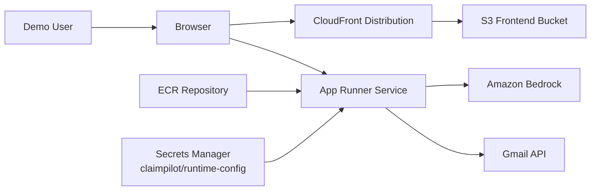

# AWS Infrastructure Architecture

This document explains the deployed ClaimPilot AWS architecture, each component used, and why it exists.

## Goal

- Single-command Terraform deployment.
- No manual resource creation in AWS Console.
- Backend, frontend, and runtime secrets fully wired for Strands + Gmail flows.

## High-Level Architecture

## Terraform Module Layout

- `infra/aws/main.tf`
: Root orchestration. Calls all modules and runs artifact publish steps through `local-exec`.
- `infra/aws/modules/ecr`
: Creates backend container registry.
- `infra/aws/modules/frontend`
: Creates S3 bucket, CloudFront distribution, and private-origin access policy.
- `infra/aws/modules/secrets`
: Creates and versions one runtime JSON secret in Secrets Manager.
- `infra/aws/modules/apprunner`
: Creates App Runner service and IAM roles/policies for image pull, secrets access, and Bedrock calls.

## Components and Purpose

| Component | Terraform Location | Purpose |
|---|---|---|
| ECR repository | `modules/ecr/main.tf` | Stores backend Docker image used by App Runner. |
| App Runner service | `modules/apprunner/main.tf` | Runs FastAPI backend container and exposes HTTPS service URL. |
| App Runner access role | `modules/apprunner/main.tf` | Allows App Runner build service to pull images from ECR. |
| App Runner instance role | `modules/apprunner/main.tf` | Allows runtime access to Secrets Manager, KMS decrypt, and Bedrock inference APIs. |
| Secrets Manager runtime secret | `modules/secrets/main.tf` | Holds one JSON object for runtime config and secrets (AWS creds, model ID, Gmail OAuth JSON/token, inbox settings). |
| S3 bucket | `modules/frontend/main.tf` | Hosts built static React assets. |
| CloudFront distribution | `modules/frontend/main.tf` | Serves frontend globally over HTTPS and routes SPA paths to `index.html`. |
| CloudFront OAC + bucket policy | `modules/frontend/main.tf` | Keeps S3 bucket private while allowing CloudFront read access. |
| Terraform local-exec backend artifact | `infra/aws/main.tf` | Logs into ECR, builds backend image, tags, and pushes it. |
| Terraform local-exec frontend artifact | `infra/aws/main.tf` | Builds frontend with deployed backend URL and syncs `dist` to S3. |

## Deployment Sequence

1. Terraform creates ECR repository.
2. Terraform local-exec builds and pushes backend image to ECR.
3. Terraform creates Secrets Manager runtime secret and version.
4. Terraform creates App Runner service wired to ECR image and runtime secret injection.
5. Terraform local-exec builds frontend with `VITE_API_BASE=https://<app-runner-url>`.
6. Terraform syncs frontend build output to S3.
7. CloudFront serves the deployed frontend globally.

## Where Strands Is Installed in AWS

Strands is installed inside the backend Docker image at build time:

- Docker build runs `pip install -e .` from `Dockerfile`.
- `pyproject.toml` declares `strands-agents` dependency.
- The built image is pushed to ECR.
- App Runner pulls that image and runs the service.

So the install location is the container filesystem running in App Runner, not a separate AWS managed package service.

## Secret Management Pattern

Best pattern for this repository is one Terraform-managed JSON secret object:

- Secret name: `claimpilot/runtime-config` (configurable with `runtime_secret_name`).
- Injected into runtime as: `CLAIMPILOT_RUNTIME_SECRETS_JSON`.
- Parsed by backend startup config to hydrate runtime values.

Benefits:

- No manual per-key secret setup in Console.
- Versioned updates through Terraform state and plan/apply.
- One contract between infra and application runtime.

## Runtime Data Paths

- Frontend to backend: CloudFront-hosted SPA calls App Runner API URL.
- Backend to Bedrock: Strands runtime uses AWS creds and `CLAIMPILOT_MODEL_ID` from runtime secret.
- Backend to Gmail: Gmail adapter reads OAuth client/token JSON from runtime secret and uses Gmail APIs.

## Operations Notes

- Update runtime secret values by editing `infra/aws/terraform.tfvars` and running `terraform apply`.
- App Runner auto-deployment is enabled in Terraform module.
- Destroy full stack with `terraform -chdir=infra/aws destroy`.